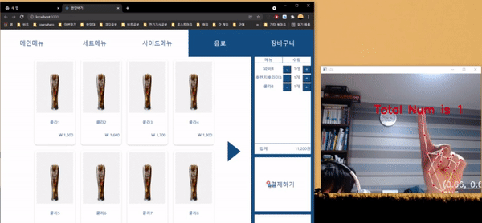
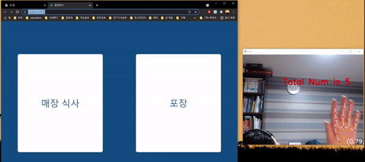

# Hanyang Univ. Electric Engineering Graduate Project

## 0. 개요
Web Camera -> Key-point Detection + Gesture Clustering -> Untact Keyboard, Mouse -> Kiosk Demo with Homepage
Contributors Method 1,2,3 : [Wonseo-C](https://github.com/Wonseo-C), [DukiChoi](https://github.com/DukiChoi)
Contributors Method 4 : [J-Shine](https://github.com/J-Shine)
## 1. Method (1): Untact Keyboard
  * Mediapipe Library : 손의 Key-point Detection
  * 각 연결 선의 벡터 사이각을 KNN으로 Clustering (Gesture 분석)
## 2. Method (2): Untact Mouse
  * 마우스 포인터 위치 (8번)으로 마우스의 움직임과 클릭을 구현
## 3. Method (3): Covert Keyboard and Mouse
  * ok 사인을 통해 전환

## 4. Kiosc Web Page
  * React를 이용하여 Single Page Application으로 제작
  * Data: Hard Coded
  * Surver: Node.js

## Demo Video
### 1. Keyboard

### 2. Mouse

